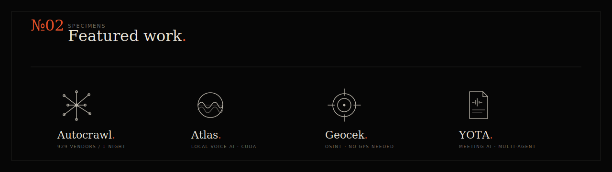
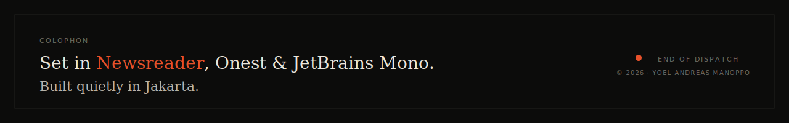

<!-- FIELD DISPATCH · YOEL ANDREAS MANOPPO -->

<p align="center">
  
</p>

<p align="center">
  <a href="https://yoel.pw"></a>
  <a href="https://www.linkedin.com/in/yoelmanoppo"></a>
  <a href="https://x.com/vehunt"></a>
  <a href="https://open.spotify.com/artist/2ztUmew6tgNQ8JtRRep4Td"></a>
</p>

---

## №01 · The Pursuit

*AI Forward Deployed Engineer pada tim inti **4 orang** yang membangun multi-agent AI skala nasional untuk operasi intelijen di Indonesia. Production infrastructure, bukan side project.*

Spesialisasi gue gak cuma wire-up API: gue bangun sistem yang **reasoning otonom across multi-tier search pipelines**, resolve entity identity lewat **constraint intersection**, jalan 24 jam tanpa supervision, dan scale dari 5 worker ke 50 on-demand.

**Stack inti hari-hari:**

```text
AI · ORCHESTRATION    LangGraph · LangChain · Ollama · OpenAI · Groq · Whisper · IBM Granite · NLLB · GPT-4o · Gemini
BACKEND               Python · FastAPI · PostgreSQL · Redis · Docker · Playwright · Crawl4AI · SQLAlchemy
FRONTEND              Vue 3 · TypeScript · React · Next.js · TailwindCSS · MapLibre GL · Apache ECharts · Vue Flow
OBSERVABILITY         Prometheus · Grafana · Langfuse · ChromaDB · FlareSolverr · OpenSERP · Structlog
BLOCKCHAIN            VeChain · Solidity · Hardhat · Web3
INFRASTRUCTURE        CUDA 12.x · AWS · Docker · Ubuntu · OSINT · OSM
```

Background lintas domain: defense AI, blockchain ([VeBetterDAO ecosystem](https://vebetterdao.org)), eCommerce automation, digital agency. **Selalu**: musisi di samping ([Cubicube](https://open.spotify.com/artist/2ztUmew6tgNQ8JtRRep4Td) on Spotify sejak 2020).

---

<p align="center">
  
</p>

### №01 · Autocrawl · Autonomous intelligence crawler

LangGraph state machine fan-out ke **50 parallel workers**, ngecrawl security & defense expo vendors lewat open web. Multi-tier search pipeline: Wikipedia REST direct, DuckDuckGo, Google News RSS, dan OpenSERP yang ngejalanin Google + Bing + Yandex + Baidu simultaneously via headless Chromium. PDF brosur discovery + OCR via Ollama vision (`gemma4:e4b`). Vendor identity resolution lewat `schema.org` + anchor link analysis + LLM tiebreak. Chroma vector store dedup cosine similarity. NLLB-200 translate semua enriched data ke Bahasa Indonesia locally.

Vue 3 tactical dashboard: 2.5D world map dengan cylinder bars per country, fly arcs antar intelligence hubs, interactive drilldown panels, dan live LangGraph canvas yang nampilin state machine real-time. Full observability stack: Prometheus metrics, Grafana dashboards, Langfuse LLM tracing, structlog structured logging, per-domain Redis rate limiting.

> **929 vendors indexed in one overnight run · 12× original throughput estimate · 150 vendors/hour at peak · 104 fully enriched · 497 translated to Bahasa Indonesia**

`LangGraph` `LangChain` `Playwright` `Crawl4AI` `Ollama` `IBM Granite` `FastAPI` `PostgreSQL` `Redis` `ChromaDB` `Vue 3` `MapLibre GL` `Apache ECharts`

### №02 · Atlas · Local AI voice intelligence

End-to-end local voice AI pipeline. Whisper handle speech-to-text dengan GPU acceleration via CUDA 12.x — support Blackwell RTX 50xx lewat nightly PyTorch builds. LLM inference bisa route ke Ollama (local), Groq (cloud speed), atau OpenRouter (model flexibility). edge-TTS convert response ke natural speech. WebSocket live mode buat real-time conversation. Persistent memory layer cross-session. Model benchmark suite bandingin latency dan quality across providers. **Designed jalan tanpa network dependency**.

> **WebSocket live conversation · GPU-accelerated ASR · 3 LLM backends · benchmarkable · fully offline-capable**

`Whisper` `Ollama` `Groq` `OpenRouter` `edge-TTS` `FastAPI` `WebSocket` `CUDA 12.x`

### №03 · Geocek · OSINT geolocation engine

Geolocate gambar cuma dari visual cues. Gak butuh GPS metadata. License plate prefix mapping narrowin search ke regional bounding box. Road classification, lane count, dan median presence filter candidates dari Overpass API. Fuzzy landmark normalization handle misspelled atau partial POI mentions. Constraint intersection logic progressively eliminate candidates yang fail multiple criteria simultaneously. Weighted confidence scoring estimate paling-likely location plus radius of error. Output: text report, GeoJSON, interactive Folium map per analysis.

> **100 % free APIs · signal extraction → area refinement → Overpass query → constraint filtering → confidence scoring**

`Python` `OSM Nominatim` `Overpass` `GPT-4o` `LangChain` `Mapbox`

### №04 · YOTA · AI minutes-of-meeting generator

Asisten Rapat AI Cerdas. Convert meeting recording jadi structured documents: executive summary, discussion points, action items. Whisper handle transcription dengan automatic chunking buat meeting 3+ jam. Speaker diarization otomatis labelin speaker. CrewAI multi-agent system bikin professional document structure. Real-time progress monitoring during processing. Export PDF, DOCX, Markdown, plain text. Action items langsung sync ke task database.

> **Long-form audio (3+ hr) · multi-agent CrewAI workflow · speaker diarization · multi-format export**

`Next.js 15` `React 19` `FastAPI` `Whisper` `GPT-4o` `CrewAI` `SQLite`

### Plus 8 specimen lagi

**Sentinel** (AntiFraud heuristics) · **Juscat** (VeChain dApp + AI image validation) · **ReUse** (photo-verified reuse rewards on VeBetterDAO) · **SoapyWorld** (gamified sustainability dApp · 800+ confirmed activities) · **AI Deskriptor** (e-commerce content generator) · **Sekriptor** (AI script generator) · **Scope of Work** (documentation platform) · **Field Dispatch** (this portfolio).

[**Open full specimens → yoel.pw/projects**](https://yoel.pw/projects)

---

## №03 · The Wire

[**`yoel.pw`**](https://yoel.pw) punya **Talkative Yoel** — AI persona yang grounded di pengalaman ini. Bukan FAQ, ngomong as me. Pake compacted memory per browser via localStorage, jadi continuity nyambung sampai lo refresh.

Tanya soal kerjaan, project, salary, opinion teknis, atau musik. Live channel, fade-in reveal, no model leaks.

---

## №04 · Engage

| Direct lines | Off the record |
|---|---|
| [yoelandreasmanoppo@gmail.com](mailto:yoelandreasmanoppo@gmail.com) | [github.com/Y0EL](https://github.com/Y0EL) |
| [+62 899 224 6000](https://wa.me/628992246000) (WhatsApp) | [@vehunt](https://x.com/vehunt) on X |
| [linkedin.com/in/yoelmanoppo](https://www.linkedin.com/in/yoelmanoppo) | [@yoelmanoppo](https://www.instagram.com/yoelmanoppo) on Instagram |

**Open to**: AI systems consulting · agentic architecture · forward-deployed engineering roles.
**Region**: Indonesia · Remote Asia-Pacific · International.

---

<p align="center">
  
</p>
